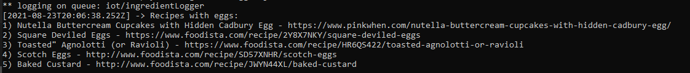

# EmptyTheFridge

## Summary
[- Introduction](#introduction): brief introduction to the problem  
[- Architecture](#architecture): architecture of the idea  
[- Project structure](#project-structure): how the project is organized  
[- Getting started](#getting-started): guide to run the project <br>
[- An example](#an-example): an example of how the project works

## Introduction
This is a project for the exam of Serverless Computing for IoT.

How many times in the **fridge** do we have:
- some **ingredients** that we do not know how to use?
- some ingredients which are about to expire and must be consumed?

Not only is there the problem of **empty the fridge** for the options mentioned above, but also the problem of having **guests** at dinner and not knowing **what to cook** (especially in cases of intolerance and **vegetarianism** for example).

So the idea is to get **several recipes through one ingredient** to resolve the problems cited previously. In particular, will be received **5 recipes with the ingredient indicate**d. If some of these 5 recipes are vegetarian, then it will be send an **email indicates only the vegetarian recipes** (so we know faster what are the recipes suitable for eventual vegetarian guests).

All the recipes are obtained through **Spoonacular API** (https://spoonacular.com/food-api).

## Architecture
To send the ingredient and obtaining recipes there is the function ***'sendrecipes'*** on Nuclio.

The ingredient is sent in the **body of request**, after the function with a call API finds 5 recipes with that ingredient, and check if there are any vegetarian recipes.

And then all 5 recipes are published in the queue ***'iot/recipes'*** of **RabbitMQ**, while the vegetarian recipes are published in the queue ***'iot/alertVeg'*** always of **RabbitMQ**. 

When a message is published in the queue ***'iot/recipes'***, the function ***'getrecipes'*** on Nuclio is triggered. This function publishes the message with recipes in the queue ***'iot/ingredientLogger'***.

When a message is published in the ***'iot/alertVeg'*** queue, the function ***'alertvegetarian'*** on Nuclio is triggered, and send an email with the vegetarian recipes.

<p align="center">

</p>

## Project Structure
- yaml_functions/
  - _**sendrecipes.yaml**_: thanks to the ingredient passed in the body, takes care of sending the recipes and vegetarian recipes, to the queues **iot/recipes** and **iot/alertVeg** respectively
  - _**getrecipes.yaml**_: takes care of receiving recipes and sending them to the queue **iot/ingredientLogger**
  - _**alertvegetarian.yaml**_: takes care of receiving vegetarian recipes and sending them to an email address
- _**logger.js**_: takes care of printing the 5 recipes, with the ingredient, chosen that are obtained

## Getting Started
> EmptyTheFridge requires to run:
> -  [Node.js](https://nodejs.org/en/)
> -  [Docker](https://www.docker.com/products/docker-desktop)
> -  [Spoonacular API Account](https://spoonacular.com/food-api)
> -  [IFTT account](https://ifttt.com/)

After creating an IFTT account, you have to create a new Applet:
  - Use WebHooks in _"if"_ section and click on  _"Receive a web request"_
  - Set Event Name to: _"alertVeg"_
  - Use Gmail in _"then"_ section and click on  _"Send an email"_
  - Set the field _"To address"_ with your email and _"Subjet/Body"_ as follows:
  <p align=center> </p>
  <ul>
  <li>Save your API key to call the HTTP request from functions</li>
</ul>

From **different** terminals, start the docker to run RabbitMQ and Nuclio with these following commands:  
- **Docker RabbitMQ**:
  ```sh
  docker run -p 9000:15672  -p 1883:1883 -p 5672:5672  cyrilix/rabbitmq-mqtt
  ```
- **Docker Nuclio**:
  ```sh
  docker run -p 8070:8070 -v /var/run/docker.sock:/var/run/docker.sock -v /tmp:/tmp nuclio/dashboard:stable-amd64
  ```
  
- **Update and deploy Functions**:
  - In both yaml functions, change **{YOUR_IP}** with your IP;
   - In ***'sendrecipes.yaml'*** change **{YOUR_API_KEY}** with your API key of your **Spoonacular account**;
  - In ***'alertvegerarian.yaml'*** change **{YOUR_API_KEY}** with your API key of your **IFTT account**;
  - Type '**localhost:8070**' on your browser to open the homepage of Nuclio;
  - Create new project and call it 'EmptyTheFridge';
  - Press '**Create function**', '**Import**' and upload the three functions that are in the **yaml_functions** folder;
  - Press **'Deploy'**.
- **Start Logger**: 
  open the terminal and type, from the **root of the project**:
   ```sh
  npm install amqplib
  ```
 
  ```sh
  node logger.js 192.168.1.1 # put your own ip
  ```

## An example
Once deployed all three functions and started logger, with the function ***'sendrecipes'*** we want to search some recipes that use **eggs**, for example. 

> If you need ingredient names in your application, you can download a list of the 1000 most frequently used ingredients ([Download ingredient list](https://spoonacular.com/application/frontend/downloads/top-1k-ingredients.csv)) including their id so you can call the API for more information.

So, in the body of the request we write the ingredient chosen:

<p align="center">

</p>

and click on _"Test"_.
The response message "Ingredient loaded: eggs" will appear and we can see the recipes received in the logger and in [MQTT Client](https://play.google.com/store/apps/details?id=com.gbn.mqttclient) respectively:

<p align="center">

</p>

<p align="center">

</p>

Moreover, in these 5 recipes, two of them are vegetarian, so an email will arrive with this content:

<p align="center">

</p>
